# Diagramme de Cas d'Utilisation - Application de Gestion des Déchets

## Vue d'ensemble
Ce diagramme présente tous les cas d'utilisation pour les trois acteurs principaux de l'application de gestion des déchets.

## Acteurs
- **Citoyen** : Demandeur de service
- **Collecteur** : Prestataire de service  
- **Administrateur** : Gestionnaire du système

## Diagramme Mermaid

```mermaid
graph TB
    %% Acteurs
    Citoyen[👤 Citoyen<br/>Demandeur de service]
    Collecteur[👷 Collecteur<br/>Prestataire de service]
    Admin[👨‍💼 Administrateur<br/>Gestionnaire du système]
    
    %% Cas d'utilisation du Citoyen
    subgraph UC_Citoyen["Cas d'utilisation - Citoyen"]
        UC1[Consulter le tableau de bord]
        UC2[Signaler un problème de déchets]
        UC3[Consulter ses signalements]
        UC4[Déposer une plainte]
        UC5[Consulter ses plaintes]
        UC6[Faire une demande de collecte]
        UC7[Consulter ses demandes de collecte]
        UC8[Consulter le calendrier de collecte]
        UC9[Gérer ses rappels]
        UC10[Gérer ses notifications]
        UC11[Configurer ses paramètres]
        UC12[Consulter son profil]
        UC13[Envoyer un message]
        UC14[Consulter les campagnes de sensibilisation]
    end
    
    %% Cas d'utilisation du Collecteur
    subgraph UC_Collecteur["Cas d'utilisation - Collecteur"]
        UC15[Consulter le tableau de bord]
        UC16[Consulter ses itinéraires]
        UC17[Consulter un itinéraire détaillé]
        UC18[Démarrer un itinéraire]
        UC19[Gérer les collectes]
        UC20[Démarrer une collecte]
        UC21[Valider une collecte]
        UC22[Signaler un incident]
        UC23[Consulter ses incidents]
        UC24[Terminer un itinéraire]
        UC25[Consulter les campagnes de sensibilisation]
        UC26[Gérer ses notifications]
        UC27[Envoyer un message]
    end
    
    %% Cas d'utilisation de l'Administrateur
    subgraph UC_Admin["Cas d'utilisation - Administrateur"]
        UC28[Consulter le tableau de bord]
        UC29[Gérer les utilisateurs]
        UC30[Gérer les signalements]
        UC31[Gérer les plaintes]
        UC32[Créer un itinéraire]
        UC33[Gérer les itinéraires]
        UC34[Gérer le calendrier de collecte]
        UC35[Superviser les opérations]
        UC36[Créer une notification]
        UC37[Gérer les campagnes de sensibilisation]
        UC38[Gérer les messages]
        UC39[Configurer les paramètres système]
    end
    
    %% Relations Citoyen
    Citoyen --> UC1
    Citoyen --> UC2
    Citoyen --> UC3
    Citoyen --> UC4
    Citoyen --> UC5
    Citoyen --> UC6
    Citoyen --> UC7
    Citoyen --> UC8
    Citoyen --> UC9
    Citoyen --> UC10
    Citoyen --> UC11
    Citoyen --> UC12
    Citoyen --> UC13
    Citoyen --> UC14
    
    %% Relations Collecteur
    Collecteur --> UC15
    Collecteur --> UC16
    Collecteur --> UC17
    Collecteur --> UC18
    Collecteur --> UC19
    Collecteur --> UC20
    Collecteur --> UC21
    Collecteur --> UC22
    Collecteur --> UC23
    Collecteur --> UC24
    Collecteur --> UC25
    Collecteur --> UC26
    Collecteur --> UC27
    
    %% Relations Administrateur
    Admin --> UC28
    Admin --> UC29
    Admin --> UC30
    Admin --> UC31
    Admin --> UC32
    Admin --> UC33
    Admin --> UC34
    Admin --> UC35
    Admin --> UC36
    Admin --> UC37
    Admin --> UC38
    Admin --> UC39
    
    %% Relations d'inclusion et d'extension
    UC2 -.->|inclut| UC13
    UC4 -.->|inclut| UC13
    UC6 -.->|inclut| UC13
    UC18 -.->|inclut| UC17
    UC20 -.->|inclut| UC17
    UC21 -.->|inclut| UC17
    UC22 -.->|inclut| UC27
    UC30 -.->|inclut| UC38
    UC31 -.->|inclut| UC38
    UC35 -.->|inclut| UC38
    
    %% Relations de dépendance
    UC2 -->|notifie| UC30
    UC4 -->|notifie| UC31
    UC6 -->|notifie| UC32
    UC18 -->|notifie| UC35
    UC22 -->|notifie| UC35
    UC32 -->|assigne| UC16
    UC36 -->|informe| UC10
    UC36 -->|informe| UC26
    
    %% Styling
    classDef acteur fill:#e1f5fe,stroke:#01579b,stroke-width:2px
    classDef uc_citoyen fill:#f3e5f5,stroke:#4a148c,stroke-width:1px
    classDef uc_collecteur fill:#e8f5e8,stroke:#1b5e20,stroke-width:1px
    classDef uc_admin fill:#fff3e0,stroke:#e65100,stroke-width:1px
    
    class Citoyen,Collecteur,Admin acteur
    class UC1,UC2,UC3,UC4,UC5,UC6,UC7,UC8,UC9,UC10,UC11,UC12,UC13,UC14 uc_citoyen
    class UC15,UC16,UC17,UC18,UC19,UC20,UC21,UC22,UC23,UC24,UC25,UC26,UC27 uc_collecteur
    class UC28,UC29,UC30,UC31,UC32,UC33,UC34,UC35,UC36,UC37,UC38,UC39 uc_admin
```

## Légende

### Types de relations :
- **Flèche simple** : Relation d'association entre un acteur et un cas d'utilisation
- **Flèche pointillée avec "inclut"** : Relation d'inclusion (un cas d'utilisation inclut un autre)
- **Flèche simple avec libellé** : Relation de dépendance (un cas d'utilisation dépend d'un autre)

### Couleurs :
- **Bleu** : Acteurs
- **Violet** : Cas d'utilisation du Citoyen
- **Vert** : Cas d'utilisation du Collecteur
- **Orange** : Cas d'utilisation de l'Administrateur

## Résumé des cas d'utilisation par acteur

### Citoyen (14 cas d'utilisation)
1. Consulter le tableau de bord
2. Signaler un problème de déchets
3. Consulter ses signalements
4. Déposer une plainte
5. Consulter ses plaintes
6. Faire une demande de collecte
7. Consulter ses demandes de collecte
8. Consulter le calendrier de collecte
9. Gérer ses rappels
10. Gérer ses notifications
11. Configurer ses paramètres
12. Consulter son profil
13. Envoyer un message
14. Consulter les campagnes de sensibilisation

### Collecteur (13 cas d'utilisation)
1. Consulter le tableau de bord
2. Consulter ses itinéraires
3. Consulter un itinéraire détaillé
4. Démarrer un itinéraire
5. Gérer les collectes
6. Démarrer une collecte
7. Valider une collecte
8. Signaler un incident
9. Consulter ses incidents
10. Terminer un itinéraire
11. Consulter les campagnes de sensibilisation
12. Gérer ses notifications
13. Envoyer un message

### Administrateur (12 cas d'utilisation)
1. Consulter le tableau de bord
2. Gérer les utilisateurs
3. Gérer les signalements
4. Gérer les plaintes
5. Créer un itinéraire
6. Gérer les itinéraires
7. Gérer le calendrier de collecte
8. Superviser les opérations
9. Créer une notification
10. Gérer les campagnes de sensibilisation
11. Gérer les messages
12. Configurer les paramètres système

## Interactions entre acteurs

Le diagramme montre les principales interactions :
- Les citoyens signalent des problèmes qui sont traités par les administrateurs
- Les administrateurs créent des itinéraires assignés aux collecteurs
- Les collecteurs exécutent les collectes et signalent des incidents
- Tous les acteurs peuvent communiquer via la messagerie
- Les notifications et campagnes sont diffusées par les administrateurs vers tous les utilisateurs